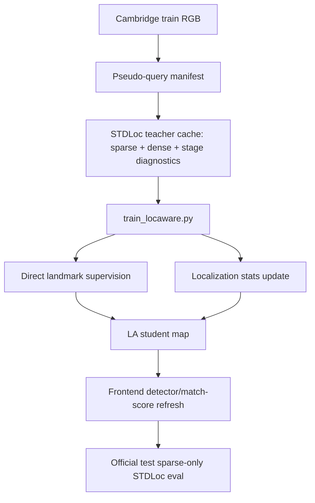

# LA_update24: Training Mainline Refactor and 100/500-step Full-chain Check

Date: 2026-06-30

## Scope

This update closes the immediate training-mainline concern raised after LA_update23: the default LA run must not silently depend on teacher-ok gates, stage gates, synthetic QA gates, valid/support masks, or stale teacher-cache selection when the goal is to test whether all train RGB supervision can train the LA student.

The verified default path in this round is:

1. Build an all-train RGB pseudo-query manifest.
2. Run full STDLoc teacher cache for all train RGB records, including sparse/dense/stage diagnostics.
3. Train a scratch LA student for a short controlled budget.
4. Update localization statistics from visible direct landmarks without reliability/stage hard gates.
5. Refresh the frontend detector/match-score artifacts.
6. Run official test sparse-only STDLoc evaluation.

Synthetic/MAtCha RGB, NoReferenceValidMask, ArtifactDetector, ArtifactRepair, and teacher-ok sample gating are intentionally not part of this default mainline run.

## Mainline Changes Verified

`scripts/run_la_pseudo_query_pipeline.sh`

- `PSEUDO_QUERY_RELIABILITY_MODE=none` by default.
- `PSEUDO_QUERY_STAGE_OBJECTIVE_MODE=none` by default.
- `LA_DIRECT_DEPTH_CHECK=0` by default.
- `--direct_depth_check` is only passed when explicitly enabled.

`train_locaware.py`

- Writes `loc_training_summary.json` for every LA run.
- Tracks pseudo-query episode counts, direct visible landmark counts, stats update counts, and skip reasons.
- Reliability/stage labels remain available for diagnostics, but no longer suppress localization-stat updates unless the corresponding policy is explicitly enabled.

## Commands / Settings

Common settings:

- Data root: `/mnt/pool/sqy/Cambridge_stdloc`
- Scenes: `ShopFacade`, `OldHospital`
- Pseudo-query source: real `train_rgb` only
- Synthetic source: disabled
- RGB teacher rendering: disabled
- Student mode: scratch LA run with direct landmark teacher
- Bootstrap landmarks: 4096
- Detector refresh: enabled
- Official eval: enabled

Run roots:

- 100-step: `/mnt/pool/sqy/stdloc_la_mainline_refactor_100_20260630`
- 500-step: `/mnt/pool/sqy/stdloc_la_mainline_refactor_500_20260630`

## Teacher Cache Sanity

ShopFacade all-train cache:

- cache count: 231
- stage counts: `teacher_ok=185`, `mixed_or_uncertain=43`, `sparse_failure=3`
- sparse valid mask: disabled

OldHospital all-train cache:

- cache count: 895
- stage counts: `teacher_ok=103`, `dense_rescues_sparse=237`, `dense_improves_sparse=136`, `dense_regression_after_good_sparse=11`, `mixed_or_uncertain=330`, `sparse_failure=78`
- sparse valid mask: disabled

Important interpretation: these labels are diagnostics only in this mainline. They are not hard gates for the student training pool.

## Training-entry Evidence

All 100/500-step runs consumed pseudo-query episodes and updated localization statistics. There is no evidence of hidden teacher-stage short-circuiting in these runs.

| Scene | Run | Episodes | Pseudo episodes | Direct visible | Stats updates | Reliability skips | Stage skips | Train RGB episodes |
| --- | ---: | ---: | ---: | ---: | ---: | ---: | ---: | ---: |
| ShopFacade | 100-step seed150 | 100 | 100 | 99 | 99 | 0 | 0 | 100 |
| OldHospital | 100-step seed151 | 100 | 100 | 100 | 100 | 0 | 0 | 100 |
| ShopFacade | 500-step seed160 | 500 | 500 | 497 | 497 | 0 | 0 | 500 |
| ShopFacade | 500-step seed162 | 500 | 500 | 498 | 498 | 0 | 0 | 500 |
| OldHospital | 500-step seed161 | 500 | 500 | 500 | 500 | 0 | 0 | 500 |

## Official Sparse-only Results

Sparse and dense columns are identical in these result JSONs because the official sparse-only evaluation is the relevant output for this check.

| Scene | Model | Median TE cm | Median AE deg | 5cm/5deg | 2cm/2deg | 2m/5deg | Avg inliers |
| --- | --- | ---: | ---: | ---: | ---: | ---: | ---: |
| ShopFacade | STDLoc baseline 30000 | 3.350 | 0.167 | 0.728 | 0.262 | 1.000 | 388.1 |
| ShopFacade | all-train 100-step seed150 | 6.441 | 0.340 | 0.320 | 0.019 | 0.971 | 117.5 |
| ShopFacade | all-train 500-step seed160 | 3.812 | 0.209 | 0.689 | 0.194 | 1.000 | 285.9 |
| ShopFacade | all-train 500-step seed162 | 3.428 | 0.189 | 0.718 | 0.184 | 1.000 | 318.5 |
| OldHospital | STDLoc baseline 30000 | 18.394 | 0.338 | 0.033 | 0.005 | 1.000 | 274.8 |
| OldHospital | all-train 100-step seed151 | 43.353 | 0.842 | 0.022 | 0.000 | 0.775 | 68.4 |
| OldHospital | all-train 500-step seed161 | 21.305 | 0.391 | 0.060 | 0.000 | 1.000 | 189.0 |

Result paths:

- `/root/STDLoc/results/pseudo-query-100-_mnt_pool_sqy_stdloc_la_mainline_refactor_100_20260630_ShopFacade_student_scratch_100step_seed150-20260630_124949/summary.json`
- `/root/STDLoc/results/pseudo-query-100-_mnt_pool_sqy_stdloc_la_mainline_refactor_100_20260630_OldHospital_student_scratch_100step_seed151-20260630_131450/summary.json`
- `/root/STDLoc/results/pseudo-query-500-_mnt_pool_sqy_stdloc_la_mainline_refactor_500_20260630_ShopFacade_student_scratch_500step_seed160-20260630_132401/summary.json`
- `/root/STDLoc/results/pseudo-query-500-_mnt_pool_sqy_stdloc_la_mainline_refactor_500_20260630_ShopFacade_student_scratch_500step_seed162-20260630_134254/summary.json`
- `/root/STDLoc/results/pseudo-query-500-_mnt_pool_sqy_stdloc_la_mainline_refactor_500_20260630_OldHospital_student_scratch_500step_seed161-20260630_134658/summary.json`

## Conclusions

1. The previous high-impact implementation concern is substantially closed for the current real-train mainline: training episodes are not blocked by teacher-ok or stage labels, and `loc_training_summary.json` confirms that direct localization supervision and stats updates actually run.
2. 100-step is only a plumbing check. It is too short and too weak for accuracy claims.
3. 500-step gives a clear positive direction over 100-step on both scenes:
   - ShopFacade improves from 6.44 cm / 0.34 deg to 3.43-3.81 cm / 0.19-0.21 deg.
   - OldHospital improves from 43.35 cm / 0.84 deg to 21.31 cm / 0.39 deg and restores 2m/5deg recall to 1.0.
4. The current method does not yet beat the mature STDLoc baseline:
   - ShopFacade seed162 is close to baseline, but still lower on inliers and 2cm recall.
   - OldHospital remains below baseline on median TE/AE and inliers, though its 5cm recall is slightly higher in this short run.
5. The main remaining issue is no longer a hidden teacher-cache gate. It is that the current student training objective and short frontend refresh are not yet strong enough to reproduce or exceed the 30000-step STDLoc baseline.

## Why the larger goal is still not closed

The goal has repeatedly failed to close because several different hypotheses were previously mixed together:

- Whether LA training actually receives useful episodes.
- Whether teacher stage labels should gate samples.
- Whether synthetic RGB is trustworthy.
- Whether valid/support masks should affect sparse matching or dense refinement.
- Whether the student has a well-posed objective beyond copying sparse/dense teacher behavior.

This update isolates the first item and shows it is now working for real train RGB. It does not validate synthetic RGB, artifact repair, or no-reference valid masks.

From first principles, the remaining bottlenecks are:

- The 500-step scratch check is still far shorter than the 30000-step baseline training budget.
- Frontend detector refresh is also short and likely under-trained relative to the baseline.
- Current LA learning mostly updates map/features/statistics from teacher-visible landmarks; it does not yet learn a robust policy for hard/negative samples.
- OldHospital has many medium-error seq4/seq8 test frames with sufficient inliers but decimeter-level translation error, which suggests geometric/landmark quality and frontend ranking issues rather than complete sparse failure.
- Synthetic/MAtCha data may help distribution coverage, but it should be reintroduced only after the real-train mainline baseline recovery is stable.

## Current Default Pipeline After Refactor

Default disabled modules for this run:

- MAtCha/WildGaussians synthetic RGB
- teacher-ok hard gate
- stage-objective hard gate
- NoReferenceValidMask
- ArtifactDetector/ArtifactRepair
- physical Gaussian prune

## Next Actions

1. Extend the same cleaned real-train mainline to longer training budgets before making final accuracy claims: at least 2000/5000-step, then a full-budget comparison if trend remains positive.
2. Reintroduce MAtCha synthetic only as a controlled branch: real-train only vs real-train + MAtCha synthetic, with no teacher-ok gate and no sample ranking gate.
3. Redesign valid/support masks as no-reference local visibility priors, then test them only where they enter the actual sparse/dense matching path.
4. Add per-sequence diagnostics for OldHospital seq4/seq8 to separate high-inlier geometric bias from sparse match failure.
5. Keep `loc_training_summary.json` as a required acceptance check for every future training run.
