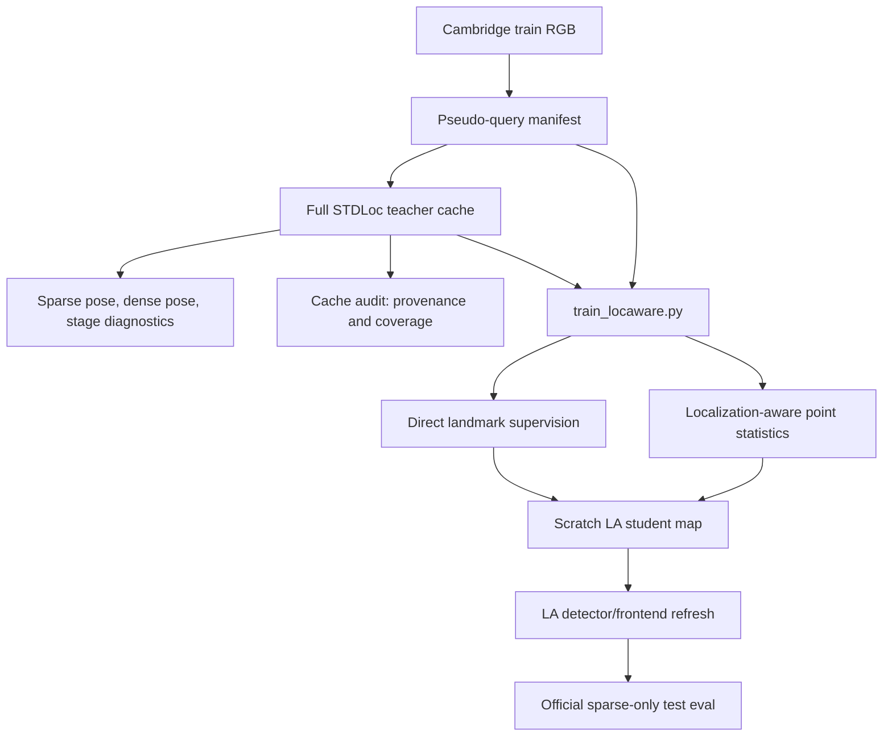

# LA_update25: Clean Real-train Mainline Refactor and 2000-step Check

Date: 2026-06-30

## Scope

This update continues the training-mainline refactor after LA_update24. The goal is to keep the default LA-STDLoc training path narrow enough to reason about:

1. all Cambridge train RGB as pseudo-query episodes;
2. full STDLoc teacher cache for sparse/dense/stage diagnostics;
3. scratch LA student training;
4. localization-aware frontend refresh;
5. official sparse-only test evaluation.

Synthetic RGB, teacher-ok gating, selector ranking, NoReferenceValidMask, ArtifactDetector/Repair, region weighting, and direct depth checks remain disabled in this clean path.

## Code Changes

### Clean entrypoint

Added:

- `/root/STDLoc/scripts/run_la_clean_real_train_mainline.sh`

This wrapper hard-disables the experimental branches that previously made results hard to interpret:

- `LA_ENABLE_SYNTHETIC=0`
- `TEACHER_CACHE_SPARSE_VALID_MASK=0`
- `RUN_PSEUDO_QUERY_GATE=0`
- `RUN_PSEUDO_QUERY_SELECT=0`
- `PSEUDO_QUERY_RELIABILITY_MODE=none`
- `PSEUDO_QUERY_STAGE_OBJECTIVE_MODE=none`
- `PSEUDO_QUERY_FILTER_TEACHER_CACHE=0`
- `PSEUDO_QUERY_ENABLE_TEACHER_GATE=0`
- `PSEUDO_QUERY_NO_REFERENCE_REGION_WEIGHT=0`
- `LA_DIRECT_DEPTH_CHECK=0`
- `LA_TRAIN_MODE=scratch`

It delegates to `/root/STDLoc/scripts/run_la_pseudo_query_pipeline.sh`.

### Teacher cache audit

Added:

- `/root/STDLoc/scripts/audit_pseudo_teacher_cache.py`

The audit is CPU-only and does not rerun localization. It loads the pseudo-query manifest and teacher cache, then writes a current `pseudo_teacher_cache_summary.json` with:

- absolute current `manifest` and `output` paths;
- cache count and manifest count;
- source counts;
- teacher stage counts;
- manifest-cache coverage;
- sampled missing/extra cache keys;
- preserved sparse-valid-mask config from the previous summary.

This fixes a real reproducibility issue seen in the 2000-step runs: copied/reused `pseudo_query` directories had summaries whose `manifest` and `output` paths still pointed to older 100/500-step roots. The binary cache and manifest were aligned, but the summary provenance was stale.

`run_la_pseudo_query_pipeline.sh` now runs this audit by default when both manifest and cache exist:

- `RUN_TEACHER_CACHE_AUDIT=${RUN_TEACHER_CACHE_AUDIT:-1}`

## Tests

New/updated coverage:

- `test_clean_real_train_mainline_hard_disables_experimental_branches`
- `test_teacher_cache_audit_rewrites_stale_summary_paths_and_checks_coverage`
- `test_teacher_cache_audit_cli_imports_repo_packages_without_pythonpath`
- `test_pseudo_query_pipeline_uses_candidate_multiplier_and_pool_selector`

Verified commands:

```bash
/root/miniconda3/envs/ulfloc_repro/bin/python -m unittest \
  tests.test_la_artifacts.PseudoQueryManifestTest.test_teacher_cache_audit_rewrites_stale_summary_paths_and_checks_coverage \
  tests.test_la_artifacts.PseudoQueryManifestTest.test_teacher_cache_audit_cli_imports_repo_packages_without_pythonpath \
  tests.test_full_script_args.FullRunScriptArgsTest.test_pseudo_query_pipeline_uses_candidate_multiplier_and_pool_selector \
  tests.test_full_script_args.FullRunScriptArgsTest.test_clean_real_train_mainline_hard_disables_experimental_branches

/root/miniconda3/envs/ulfloc_repro/bin/python -m py_compile scripts/audit_pseudo_teacher_cache.py

bash -n scripts/run_la_pseudo_query_pipeline.sh scripts/run_la_clean_real_train_mainline.sh
```

All passed.

The default `pytest` command still routes through a broken `iclpose` PyPy/NumPy environment on this machine, so targeted verification used the `ulfloc_repro` Python and `unittest`.

## 2000-step Runs

Run root:

- `/mnt/pool/sqy/stdloc_la_mainline_refactor_2000_20260630`

Settings:

- scenes: `ShopFacade`, `OldHospital`
- train source: `train_rgb` only
- synthetic: disabled
- teacher gate / selector: disabled
- sparse valid mask: disabled
- reliability/stage objective: disabled
- direct depth check: disabled
- student mode: scratch
- training steps: 2000
- bootstrap landmarks: 4096
- LA detector landmarks: 4096
- frontend refresh: enabled
- official eval: sparse-only

In this context, "steps" means `train_locaware.py` training iterations/episodes. Because `loc_interval=1` and pseudo-query mode is active, each step samples one pseudo-query episode.

## Cache Audit After Refresh

| Scene | Manifest records | Cache records | Missing | Extra | Stage counts |
| --- | ---: | ---: | ---: | ---: | --- |
| ShopFacade | 231 | 231 | 0 | 0 | `teacher_ok=185`, `mixed_or_uncertain=43`, `sparse_failure=3` |
| OldHospital | 895 | 895 | 0 | 0 | `teacher_ok=103`, `dense_improves_sparse=136`, `dense_rescues_sparse=237`, `dense_regression_after_good_sparse=11`, `mixed_or_uncertain=330`, `sparse_failure=78` |

Updated summaries:

- `/mnt/pool/sqy/stdloc_la_mainline_refactor_2000_20260630/ShopFacade/pseudo_query/pseudo_teacher_cache_summary.json`
- `/mnt/pool/sqy/stdloc_la_mainline_refactor_2000_20260630/OldHospital/pseudo_query/pseudo_teacher_cache_summary.json`

## Training-entry Evidence

| Scene | Episodes | Pseudo episodes | Direct visible | Stats updates | Reliability skips | Stage skips | No-visible skips | Observed points >=4 |
| --- | ---: | ---: | ---: | ---: | ---: | ---: | ---: | ---: |
| ShopFacade | 2000 | 2000 | 1977 | 1977 | 0 | 0 | 23 | 4091 |
| OldHospital | 2000 | 2000 | 2000 | 2000 | 0 | 0 | 0 | 4096 |

This confirms the clean path is not silently blocked by teacher-ok/stage gates. The remaining accuracy issue is not a hidden skipped-training bug in this path.

## Official Sparse-only Results

| Scene | Model | Median TE cm | Median AE deg | 5cm/5deg | 2cm/2deg | 2m/5deg | Avg inliers |
| --- | --- | ---: | ---: | ---: | ---: | ---: | ---: |
| ShopFacade | STDLoc baseline 30000 | 3.350 | 0.167 | 0.728 | 0.262 | 1.000 | 388.1 |
| ShopFacade | clean 100 seed150 | 6.441 | 0.340 | 0.320 | 0.019 | 0.971 | 117.5 |
| ShopFacade | clean 500 seed160 | 3.812 | 0.209 | 0.689 | 0.194 | 1.000 | 285.9 |
| ShopFacade | clean 500 seed162 | 3.428 | 0.189 | 0.718 | 0.184 | 1.000 | 318.5 |
| ShopFacade | clean 2000 seed170 | 3.622 | 0.181 | 0.689 | 0.126 | 1.000 | 351.1 |
| OldHospital | STDLoc baseline 30000 | 18.394 | 0.338 | 0.033 | 0.005 | 1.000 | 274.8 |
| OldHospital | clean 100 seed151 | 43.353 | 0.842 | 0.022 | 0.000 | 0.775 | 68.4 |
| OldHospital | clean 500 seed161 | 21.305 | 0.391 | 0.060 | 0.000 | 1.000 | 189.0 |
| OldHospital | clean 2000 seed171 | 16.285 | 0.327 | 0.082 | 0.005 | 1.000 | 234.6 |

Result paths:

- `/root/STDLoc/results/pseudo-query-2000-_mnt_pool_sqy_stdloc_la_mainline_refactor_2000_20260630_ShopFacade_student_scratch_2000step_seed170-20260630_144537/summary.json`
- `/root/STDLoc/results/pseudo-query-2000-_mnt_pool_sqy_stdloc_la_mainline_refactor_2000_20260630_OldHospital_student_scratch_2000step_seed171-20260630_145023/summary.json`

## Sequence-level Diagnostics

ShopFacade baseline:

- `seq1`: median 3.951 cm / 0.187 deg, 5cm recall 0.611, avg inliers 322.8
- `seq3`: median 3.050 cm / 0.143 deg, 5cm recall 0.791, avg inliers 423.2

ShopFacade clean 2000:

- `seq1`: median 4.846 cm / 0.199 deg, 5cm recall 0.528, avg inliers 294.2
- `seq3`: median 3.298 cm / 0.174 deg, 5cm recall 0.776, avg inliers 381.7
- worst two frames improve compared with baseline: `seq1/frame00027` 110.5 -> 98.9 cm, `seq1/frame00026` 68.5 -> 60.0 cm
- net result is still worse because median/inlier quality declines across both sequences

OldHospital baseline:

- `seq4`: median 14.240 cm / 0.343 deg, 5cm recall 0.107, avg inliers 228.9
- `seq8`: median 20.836 cm / 0.336 deg, 5cm recall 0.000, avg inliers 295.2

OldHospital clean 2000:

- `seq4`: median 13.043 cm / 0.313 deg, 5cm recall 0.125, avg inliers 226.2
- `seq8`: median 20.997 cm / 0.339 deg, 5cm recall 0.063, avg inliers 238.3
- gain comes from seq4 and a few seq8 frames crossing the 5 cm threshold
- seq8 median is essentially unchanged and inliers drop, so the hard tail remains unresolved

## Current Interpretation

The clean real-train path is now reproducible and auditable. It gives weak positive support on OldHospital but not on ShopFacade:

- OldHospital improves over the STDLoc baseline on median translation error, median rotation error, and 5cm recall: 18.394 -> 16.285 cm, 0.338 -> 0.327 deg, 0.033 -> 0.082.
- ShopFacade does not improve over baseline: 3.350 -> 3.622 cm, 0.167 -> 0.181 deg, 0.728 -> 0.689 5cm recall.
- 2000-step ShopFacade is not better than the best 500-step seed, so longer training alone is not sufficient.
- In both scenes, LA inliers remain below the original STDLoc baseline.

This means the broad LA-STDLoc claim is not closed. The current result supports a narrower statement: the cleaned all-train RGB training loop is functional and can improve one difficult scene, but the frontend/landmark quality and training objective are not yet robust enough to consistently beat the mature 30000-step STDLoc baseline.

## Why the Larger Goal Still Has Not Closed

Previous attempts kept mixing multiple variables:

- synthetic RGB quality;
- teacher-cache hard gating;
- stage-label objectives;
- valid/support mask effects;
- detector frontend refresh budget;
- scratch-vs-adapt initialization;
- whether LA statistics were actually updated.

This update closes the last item for the clean real-train path and fixes cache provenance. It does not prove that the learned student objective is optimal.

From first principles, the current bottleneck is likely the learning target and frontend selection, not just data quantity:

- The student currently learns localization-aware map features and detector statistics from teacher-visible landmarks.
- It does not yet learn a principled negative/hard-example policy.
- It does not explicitly optimize final PnP inlier geometry under official sparse-only evaluation.
- The 4096 refreshed landmark budget may be too restrictive; both scenes have fewer inliers than baseline.
- OldHospital seq8 remains a high-inlier but biased-pose regime, which points to landmark geometry/ranking rather than complete matching failure.

## Current Method Flow



Disabled by default in this mainline:

- synthetic RGB from MAtCha/WildGaussians;
- NoReferenceValidMask;
- ArtifactDetector/ArtifactRepair;
- teacher-ok gating;
- selector ranking;
- stage hard filtering;
- reliability weighting;
- physical Gaussian pruning.

## Next Actions

1. Keep this clean entrypoint as the default acceptance path.
2. Run controlled frontend-capacity ablations: 4096 vs 8192 vs 16384 landmarks, with the same 2000-step student.
3. Diagnose OldHospital seq8 and ShopFacade seq1 with per-frame match geometry, inlier 3D distribution, reprojection residuals, and landmark utility deltas between baseline and clean 2000.
4. Reintroduce MAtCha synthetic only after baseline-recovery is stable, and keep it as a separate branch with no teacher-ok gate.
5. Treat NoReferenceValidMask/ArtifactDetector/Repair as separate ablations until they show direct improvements in sparse PnP and official sparse-only pose.
