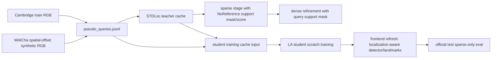

# LA_update27: Refactored Training Mainline Entry

Date: 2026-06-30

## Scope

This update starts the training-mainline refactor after the capacity ablation in `LA_update26`.

The purpose is not to claim the final LA-STDLoc method is complete. The purpose is to stop mixing old experimental branches into the default training path and to create one explicit entry for the intended next full-chain method:

1. all Cambridge train RGB pseudo-queries;
2. MAtCha-rendered synthetic RGB pseudo-queries;
3. spatial-offset novel-view sampling instead of adjacent-list interpolation;
4. no teacher hard gate;
5. no pseudo-query selector ranking;
6. no teacher-stage loss weighting;
7. complete sparse+dense STDLoc teacher cache for diagnostics and pose supervision metadata;
8. no-reference support guidance for synthetic teacher sparse/dense localization;
9. no-reference region weighting for synthetic student direct-localization loss.

## Code Changes

Added:

- `/root/STDLoc/scripts/run_la_refactored_mainline.sh`

This wrapper delegates to `scripts/run_la_pseudo_query_pipeline.sh` but hardens the mainline defaults:

- `LA_ENABLE_SYNTHETIC=1`
- `RENDER_SYNTHETIC_BACKEND=matcha`
- `PSEUDO_QUERY_POSE_SAMPLER=spatial_offset`
- `SYNTHETIC_QUALITY_GATE=0`
- `RUN_PSEUDO_QUERY_GATE=0`
- `RUN_PSEUDO_QUERY_SELECT=0`
- `PSEUDO_QUERY_ENABLE_TEACHER_GATE=0`
- `PSEUDO_QUERY_FILTER_TEACHER_CACHE=0`
- `PSEUDO_QUERY_RELIABILITY_MODE=none`
- `PSEUDO_QUERY_STAGE_OBJECTIVE_MODE=none`
- `TEACHER_CACHE_SPARSE_VALID_MASK=1`
- `TEACHER_CACHE_SPARSE_VALID_MASK_MODE=support_mask_score`
- `PSEUDO_QUERY_NO_REFERENCE_REGION_WEIGHT=1`
- `LA_TRAIN_MODE=scratch`
- `RUN_TEACHER_CACHE=1`
- `RUN_TRAIN=1`
- `RUN_EVAL=1`
- `RUN_LA_FRONTEND_REFRESH=1`

Modified:

- `/root/STDLoc/scripts/build_pseudo_teacher_cache.py`

Added `support_mask_score` mode. It uses:

- `NoReferenceValidMask.support_mask` as the hard query-region mask passed to STDLoc sparse and dense stages;
- `NoReferenceValidMask.support_score` as the soft sparse keypoint prior.

This separates the current no-reference module from the older residual-based `ArtifactDetector` path. The mode does not use reference RGB and does not use the old artifact selector.

Tests added:

- `test_refactored_mainline_uses_matcha_synthetic_without_teacher_gate_or_selector`
- `test_refactored_mainline_lowers_frontend_min_observations_for_short_smoke`
- `test_teacher_cache_support_mask_score_mode_uses_binary_support_and_soft_score`

The wrapper also lowers `LA_DETECTOR_MIN_LOC_OBSERVATIONS` to `1` when
`LA_ADAPT_STEPS < 4`, unless the caller overrides it. This is only for very
short smoke tests where each landmark can have at most one LA observation. Normal
runs keep the default `4`.

## Current Mainline Flow



Important boundary: teacher-cache sparse/dense diagnostics are retained for analysis and cache coverage, but they are not used as a hard training-pool gate in this mainline.

## Verification

Commands run:

```bash
/root/miniconda3/envs/ulfloc_repro/bin/python -m unittest \
  tests.test_full_script_args.FullRunScriptArgsTest.test_refactored_mainline_uses_matcha_synthetic_without_teacher_gate_or_selector \
  tests.test_support_sparse_pnp.SupportSparsePnpTest.test_teacher_cache_support_mask_score_mode_uses_binary_support_and_soft_score

/root/miniconda3/envs/ulfloc_repro/bin/python -m unittest \
  tests.test_support_sparse_pnp \
  tests.test_no_reference_valid_mask \
  tests.test_full_script_args.FullRunScriptArgsTest.test_refactored_mainline_uses_matcha_synthetic_without_teacher_gate_or_selector \
  tests.test_full_script_args.FullRunScriptArgsTest.test_pseudo_query_pipeline_uses_candidate_multiplier_and_pool_selector \
  tests.test_full_script_args.FullRunScriptArgsTest.test_clean_real_train_mainline_hard_disables_experimental_branches

bash -n \
  scripts/run_la_refactored_mainline.sh \
  scripts/run_la_pseudo_query_pipeline.sh \
  scripts/run_la_clean_real_train_mainline.sh \
  scripts/run_la_capacity_fullchain_ablation.sh
```

All passed.

Smoke run:

```bash
SCENES=ShopFacade SYNTHETIC_COUNT=2 LA_ADAPT_STEPS=1 LA_DETECTOR_ITERS=1 TRAIN_SEED=290 GPU=0 \
OUT_ROOT=/mnt/pool/sqy/stdloc_la_refactored_mainline_smoke_1step_20260630 \
bash scripts/run_la_refactored_mainline.sh
```

Observed:

- MAtCha rendered 2 synthetic ShopFacade frames.
- `pseudo_queries.jsonl` contained 231 `train_rgb` and 2 `synthetic_rgb` accepted records.
- `pseudo_teacher_cache.pt` contained all 233 records, with stage counts:
  `teacher_ok=186`, `mixed_or_uncertain=43`, `sparse_failure=4`.
- Teacher cache used `support_mask_score` for `synthetic_rgb` only.
- 1-step scratch student training completed and used the pseudo-query cache.
- The first full wrapper attempt failed only at frontend refresh because a
  1-step smoke cannot satisfy `min_loc_observations=4`; rerunning that exact
  frontend refresh with `--min_loc_observations 1` completed successfully.

This smoke verifies wiring and cache coverage only. It is not a pose-accuracy
claim.

## Next Runs

Recommended smoke:

```bash
SCENES=ShopFacade SYNTHETIC_COUNT=16 LA_ADAPT_STEPS=100 TRAIN_SEED=270 GPU=0 \
OUT_ROOT=/mnt/pool/sqy/stdloc_la_refactored_mainline_smoke_20260630 \
bash scripts/run_la_refactored_mainline.sh
```

Recommended first full comparison:

```bash
SCENES="ShopFacade OldHospital" SYNTHETIC_COUNT=128 LA_ADAPT_STEPS=500 TRAIN_SEED=271 GPU=1 \
OUT_ROOT=/mnt/pool/sqy/stdloc_la_refactored_mainline_500_20260630 \
bash scripts/run_la_refactored_mainline.sh
```

Then run 2000-step with `SYNTHETIC_COUNT=256` only if the 500-step result does not show obvious sparse-stage regression.

## Status

This closes a training-mainline implementation ambiguity, not the whole LA-STDLoc objective.

The next evidence required is a full-chain run from `run_la_refactored_mainline.sh` comparing:

- previous clean real-train-only 8192/16384 runs;
- refactored all-train + MAtCha synthetic;
- per-scene official sparse-only test metrics;
- teacher-cache stage/source summaries;
- support-mask sparse/dense diagnostics.
